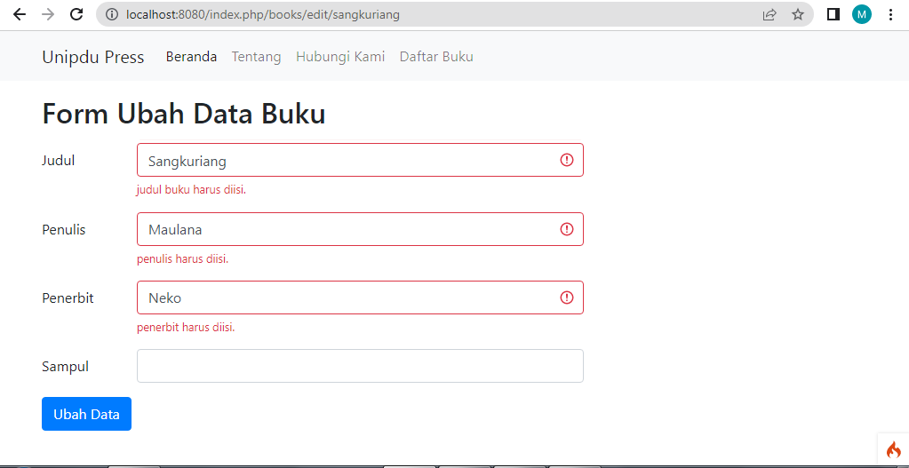
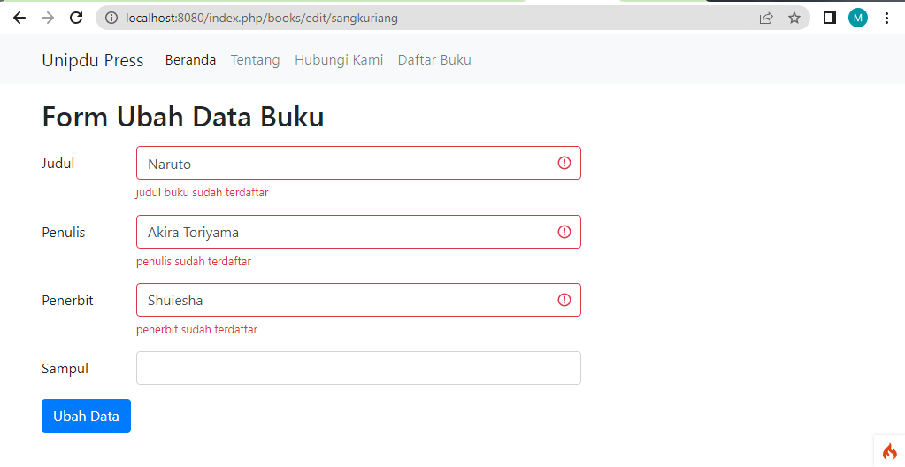
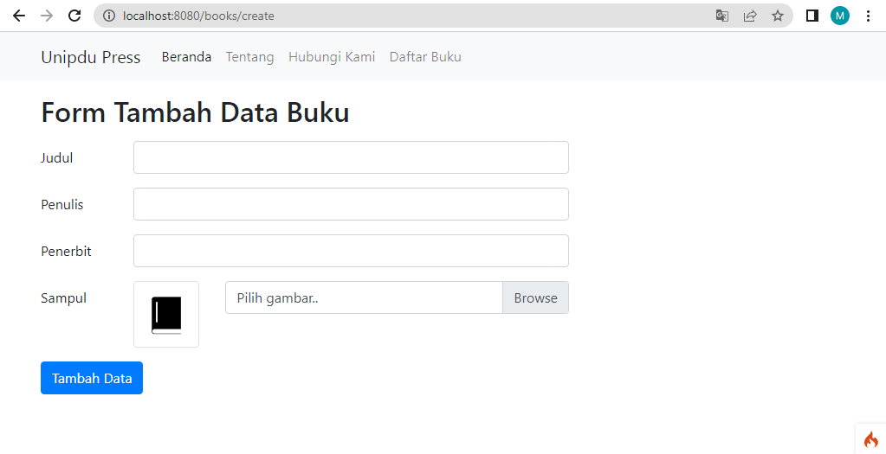
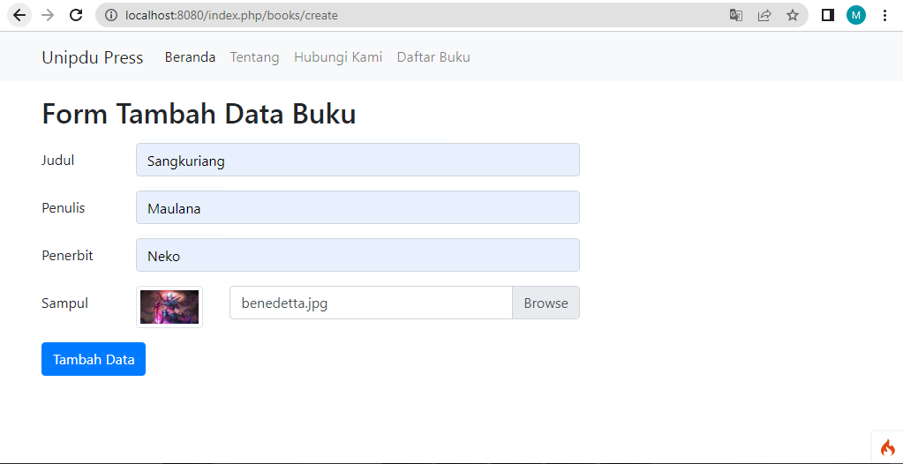
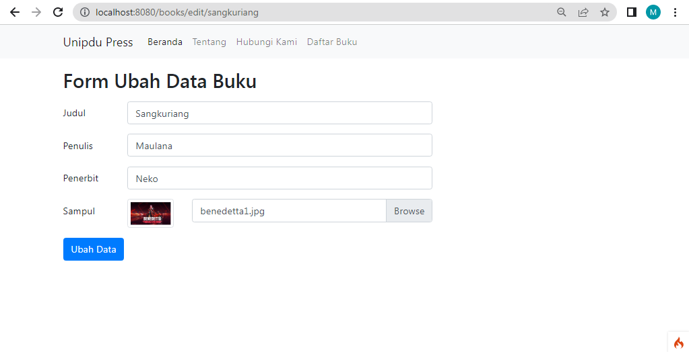
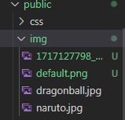
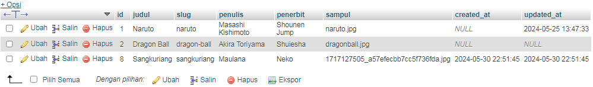
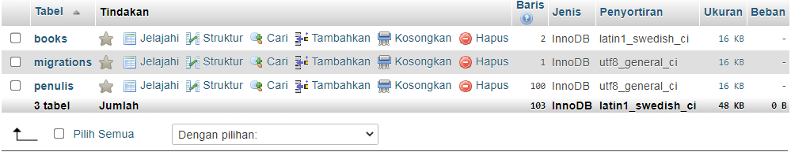
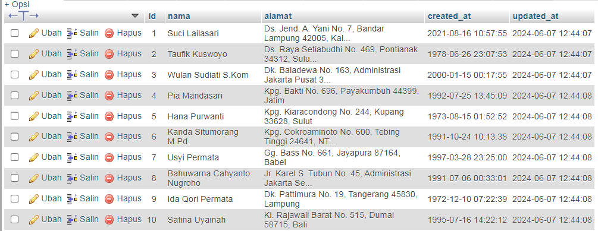

# ci4app

## Hasil Screnshot

- Jika Data Kosong
  

- Jika Data Sudah Ada
  

## UPLOAD FILE

- Form tambah Data
  

- Form tambah Data
  

- Form ubah Data
  

- Folder Public/img
  

- Database
  

## Migration dan Seedeing

- Migration
  

- Seeder
  
